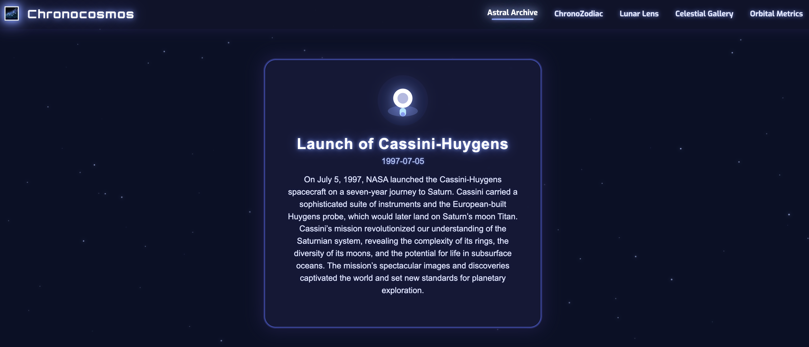
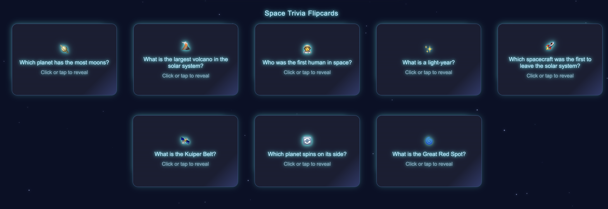
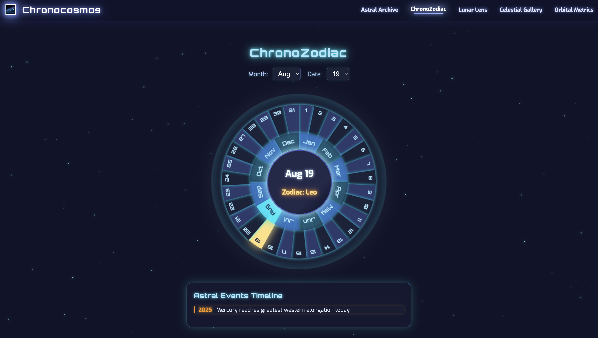
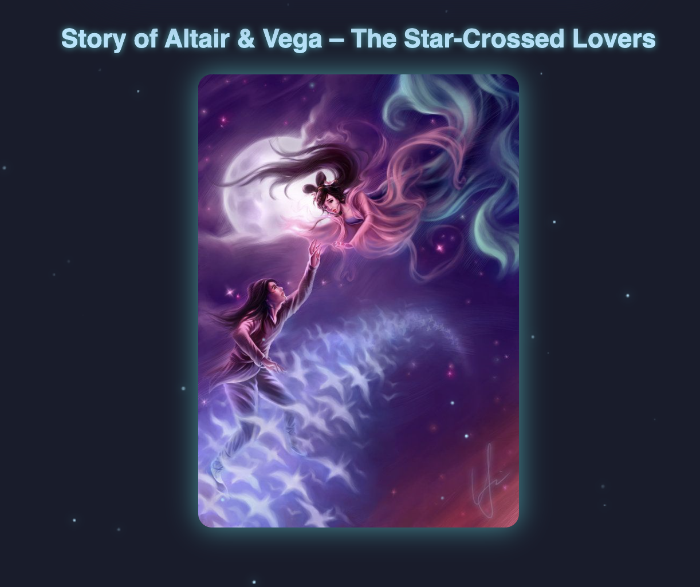
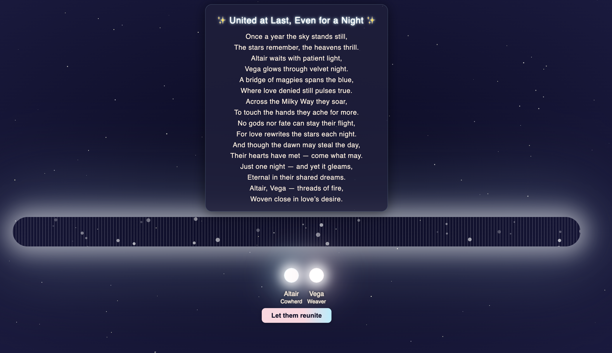
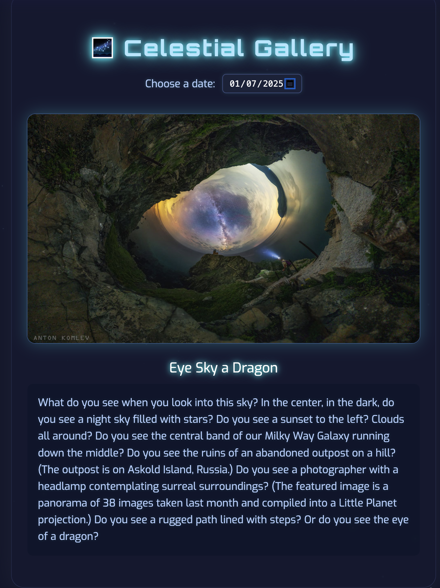
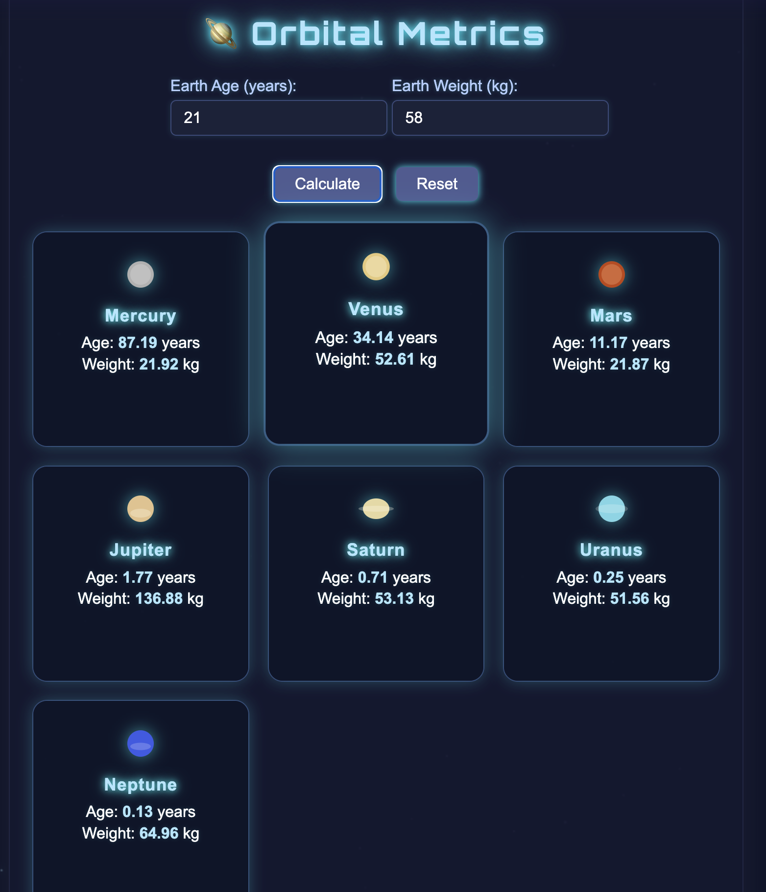

<!DOCTYPE html>
<html lang="en">
<head>
  <meta charset="UTF-8">
  <!---- <title>Chronocosmos – README</title>
   ---->
</head>
<body>

  <h1>🌌 𝐂𝐡𝐫𝐨𝐧𝐨𝐜𝐨𝐬𝐦𝐨𝐬 – 𝐄𝐱𝐩𝐥𝐨𝐫𝐞 𝐒𝐩𝐚𝐜𝐞, 𝐎𝐧𝐞 𝐃𝐚𝐭𝐞 𝐀𝐭 𝐀 𝐓𝐢𝐦𝐞!</h1>

  
<strong>🔗 𝐋𝐢𝐯𝐞 𝐖𝐞𝐛𝐬𝐢𝐭𝐞:</strong> <a href="https://chronocosmos-smoky.vercel.app/">https://chronocosmos-smoky.vercel.app/</a> 
  <strong>🔗 𝐆𝐢𝐭𝐇𝐮𝐛 𝐑𝐞𝐩𝐨:</strong> <a href="https://github.com/shasmithareddy/Chronocosmos">https://github.com/shasmithareddy/Chronocosmos</a>

  <h2>🚀 𝐅𝐞𝐚𝐭𝐮𝐫𝐞𝐬 & 𝐌𝐨𝐝𝐮𝐥𝐞𝐬</h2>
  <ul>
    <li>🗓️ <strong>𝐀𝐬𝐭𝐫𝐚𝐥 𝐀𝐫𝐜𝐡𝐢𝐯𝐞</strong>: Auto-updates based on current date. Flipcards show trivia/events. Daily JS logic.</li>
    <li>🌀 <strong>𝐂𝐡𝐫𝐨𝐧𝐨𝐙𝐨𝐝𝐢𝐚𝐜</strong>: Spinwheel to pick dates, shows zodiac & timeline.</li>
    <li>🌙 <strong>𝐋𝐮𝐧𝐚𝐫 𝐋𝐞𝐧𝐬</strong>: Moon phase SVGs, illumination %, waxing/waning with messages.</li>
    <li>✨ <strong>𝐒𝐭𝐚𝐫-𝐂𝐫𝐨𝐬𝐬𝐞𝐝 𝐒𝐭𝐨𝐫𝐲 𝐌𝐨𝐝𝐮𝐥𝐞</strong>: Click image card reveals the animated romantic tale of Altair & Vega, embedded in Lunar Lens.</li>
    <li>🌠 <strong>𝐂𝐞𝐥𝐞𝐬𝐭𝐢𝐚𝐥 𝐆𝐚𝐥𝐥𝐞𝐫𝐲</strong>: NASA APOD integration with history.</li>
    <li>🪐 <strong>𝐎𝐫𝐛𝐢𝐭𝐚𝐥 𝐌𝐞𝐭𝐫𝐢𝐜𝐬</strong>: Age & weight calculators for planets with styled cards.</li>
  </ul>

  <h2>📱 𝐑𝐞𝐬𝐩𝐨𝐧𝐬𝐢𝐯𝐞 𝐃𝐞𝐬𝐢𝐠𝐧</h2>
  <ul>
    <li>Mobile & Desktop compatible</li>
    <li>Uses Flexbox/Grid</li>
    <li>Star backgrounds and effects retained</li>
  </ul>

  <h2>📂 𝐏𝐫𝐨𝐣𝐞𝐜𝐭 𝐒𝐭𝐫𝐮𝐜𝐭𝐮𝐫𝐞</h2>
  <pre><code>
chronocosmos/
├── ind.html           ← Main entry point
├── archive.html       ← Astral Archive
├── wheel.html         ← ChronoZodiac
├── lunar.html         ← Lunar Lens (includes Altair & Vega story)
├── apod1.html         ← Celestial Gallery
├── orbital.html       ← Orbital Metrics
├── style.css          ← Shared styles
├── story.html         ← Altair Vega Animation
├── image.jpg          ← Altair Vega Image
├── assets/            ← Fonts, icons, etc.
└── README.md
  </code></pre>

  <h2>🛠️ 𝐓𝐞𝐜𝐡𝐧𝐨𝐥𝐨𝐠𝐢𝐞𝐬 𝐔𝐬𝐞𝐝</h2>
  <ul>
    <li>HTML5, CSS3, JavaScript (Vanilla)</li>
    <li>NASA APOD API</li>
    <li>Canvas & SVG Rendering</li>
    <li>CSS animations, dynamic content</li>
  </ul>

  <h2>📦 𝐈𝐧𝐬𝐭𝐚𝐥𝐥𝐚𝐭𝐢𝐨𝐧 / 𝐒𝐞𝐭𝐮𝐩</h2>
  <pre><code>
git clone https://github.com/shasmithareddy/Chronocosmos.git
cd chronocosmos
  </code></pre>
  
Open <code>ind.html</code> with <strong>Live Server</strong>. Keep all HTML files in the same folder.

  <h2>💡 𝐔𝐧𝐢𝐪𝐮𝐞 𝐈𝐧𝐭𝐞𝐫𝐚𝐜𝐭𝐢𝐯𝐞 𝐅𝐞𝐚𝐭𝐮𝐫𝐞𝐬</h2>
  <ul>
    <li>✔ Historical space data by date</li>
    <li>✔ Canvas spinwheel zodiac picker</li>
    <li>✔ Moon phase visuals + logic</li>
    <li>✔ Planet age/weight cards</li>
    <li>✔ Trivia flipcards + animations</li>
    <li>✔ Clickable Altair-Vega star-crossed love story</li>
  </ul>

  <h2>📸 𝐏𝐫𝐨𝐣𝐞𝐜𝐭 𝐒𝐜𝐫𝐞𝐞𝐧𝐬𝐡𝐨𝐭𝐬</h2>

Here’s a glimpse into Chronocosmos in action:

  

  

  

  

  

   

  

  

 <h2>⚠️ 𝐊𝐧𝐨𝐰𝐧 𝐋𝐢𝐦𝐢𝐭𝐚𝐭𝐢𝐨𝐧𝐬</h2>
<ul>
  <li>🛰️ NASA APOD fetch requires an active internet connection.</li>
  <li>📱 ChronoZodiac spinwheel is not fully optimized for mobile touch gestures yet.</li>
  <li>🌠 Astral Archive currently includes events only up to July; further events for August and beyond will be added later.</li>
  <li>🔄 On some browsers, navigation errors or blank screens (e.g., "Page Not Found") may require a manual reload to display content correctly.</li>
  <li>🖥️ Heavy canvas or animation loads may lag slightly on low-end devices or browsers.</li>
</ul>

  <h2>✨ 𝐅𝐮𝐭𝐮𝐫𝐞 𝐄𝐧𝐡𝐚𝐧𝐜𝐞𝐦𝐞𝐧𝐭𝐬</h2>
  <ul>
    <li>Star map overlays with Three.js</li>
    <li>Cosmic event reminders</li>
    <li>Save favorite dates/events</li>
    <li>“Your weight in objects” trivia</li>
  </ul>

  <h2>🙋‍♀️ 𝐃𝐞𝐯𝐞𝐥𝐨𝐩𝐞𝐝 𝐁𝐲</h2>
  
<strong>Team:</strong> 𝐋𝐨𝐧𝐞 𝐍𝐞𝐛𝐮𝐥𝐚 
  👩🏻 Shasmitha R (RA2311029010028) 
  SRM Institute of Science and Technology 
  📞 +91 86680 12212

  <h2>🛰️ 𝐂𝐫𝐞𝐝𝐢𝐭𝐬 & 𝐑𝐞𝐬𝐨𝐮𝐫𝐜𝐞𝐬</h2>
  <ul>
    <li>NASA APOD API</li>
    <li>Moon phase logic: Subsystems.us</li>
    <li>Zodiac Ranges: Wikipedia</li>
    <li>Fonts: Orbitron, Exo</li>
    <li>UI Design: Figma, Canva</li>
    <li>Icons: Flaticon, SVGRepo</li>
  </ul>

  <h2>🌌 𝐋𝐢𝐜𝐞𝐧𝐬𝐞</h2>
  
This project is open for educational and hackathon use. Fork and create your own starry version ✨

</body>
</html>
